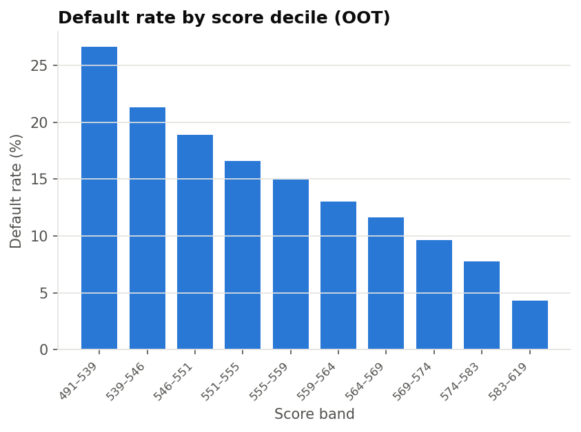

# Credit Risk PD Scorecard — LendingClub

A probability-of-default (PD) scorecard for unsecured consumer loans, built and **validated**
the way a bank's credit risk and model validation teams would do it:

- **Sample design** that avoids leakage and resolution bias (36-month loans, vintages 2007–2015)
- **WoE binning + IV**, implemented from scratch with monotonic bins and an explicit missing bin
- **Logistic regression scorecard** with significance, sign and VIF checks, scaled to points (PDO)
- **Challenger model** (gradient boosting) and an **external benchmark** (LendingClub's own sub-grade)
- **Validation** on an **out-of-time** sample: Gini/KS, rank ordering, calibration, Hosmer–Lemeshow,
  binomial test per rating grade, PSI and CSI, with traffic-light (RAG) status
- An auto-generated **validation report** (`reports/validation_report.md`)

## Results

Full run on 621,022 resolved 36-month loans (numbers from `reports/metrics.json`; full write-up in
[`reports/validation_report.md`](reports/validation_report.md)).

| Sample | Loans | Default rate | Gini | KS | Score PSI vs train |
|---|---|---|---|---|---|
| Train (≤2013) | 122,798 | 12.6% | 0.316 | 0.227 | – |
| Test (≤2013) | 52,628 | 12.6% | 0.305 | 0.221 | 0.000 |
| **Out-of-time (2014–15)** | **445,596** | **14.5%** | **0.294** | **0.211** | **0.001** |

Out-of-time Gini: scorecard 0.294 · gradient-boosting challenger 0.316 · LendingClub sub-grade 0.343.

**Key finding:** the scorecard *ranks* risk consistently out of time (Gini down only 7% from train,
monotonic default rates from 26.6% in the worst score decile to 4.3% in the best, every feature's
CSI below 0.10), but it *under-predicts* PD on 2014–15 loans (12.7% predicted vs 14.5% observed),
failing the binomial test in all 7 grades. LendingClub's later vintages took on more indebted
borrowers (average DTI 13.5% → 18.5% from 2011 to 2015), so the base default rate moved while the
risk drivers held. The remedy is an intercept recalibration on recent vintages, not a rebuild.
The challenger's in-sample edge is mostly overfitting (Gini 0.441 train → 0.325 test).



## Project structure

```
├── notebooks/
│   ├── 01_data_and_target.ipynb      sample definition, target, vintage analysis, splits
│   ├── 02_woe_binning_iv.ipynb       WoE bins, IV ranking
│   ├── 03_scorecard_model.ipynb      selection, logistic regression, points, challenger
│   └── 04_model_validation.ipynb     discrimination, calibration, stability
├── src/pdmodel/
│   ├── config.py      every setting (dates, thresholds, scaling) in one place
│   ├── data.py        loading, target definition, feature engineering, splits
│   ├── woe.py         WoE binning and IV (from scratch)
│   ├── model.py       feature selection, logistic regression, scorecard, challenger
│   ├── validation.py  Gini/KS, calibration tests, PSI/CSI, RAG thresholds
│   ├── plots.py       charts
│   └── pipeline.py    end-to-end run + report writer
├── scripts/
│   ├── run_pipeline.py          run everything, write reports/
│   └── make_synthetic_data.py   fake data for smoke-testing only
├── tests/test_core.py
└── reports/                     validation_report.md, commentary.md, tables, figures
```

## Getting the data

1. Create a free Kaggle account and download **Lending Club Loan Data** by *wordsforthewise*:
   <https://www.kaggle.com/datasets/wordsforthewise/lending-club>
   (or `kaggle datasets download -d wordsforthewise/lending-club -p data/raw --unzip`).
2. Leave `accepted_2007_to_2018Q4.csv(.gz)` anywhere under `data/raw/` — the code finds it.

The file is ~1.6 GB unzipped; only 24 columns are loaded, which needs a few GB of RAM.
`data/` is git-ignored.

## How to run

Tested with Python 3.13.

```bash
python -m venv .venv && source .venv/bin/activate
pip install -r requirements.txt

python scripts/run_pipeline.py   # full run, under a minute
python -m pytest -q              # unit tests
```

The pipeline writes every table and figure plus `reports/validation_report.md`, inserting the
analysis from `reports/commentary.md`. The notebooks (01 → 04) walk through the same steps; each
saves what the next one needs to `data/processed/`.

`python scripts/make_synthetic_data.py` writes a fake LendingClub-shaped file for testing the code
without the real data (run the pipeline with
`--data data/raw/synthetic/accepted_2007_to_2018Q4_SYNTHETIC.csv.gz`). Its results are meaningless.

## Methodology notes

| Decision | Why |
|---|---|
| Default = Charged Off / Default; Current & Late excluded | Only loans with a known final outcome |
| 36m loans issued ≤ 2015 only | Every loan had time to mature in the 2018Q4 snapshot (no resolution bias) |
| No post-origination fields | `total_pymnt`, `recoveries`, … reveal the outcome (leakage) |
| `grade`, `sub_grade`, `int_rate` excluded | They are LendingClub's own risk view; used as a benchmark instead |
| `addr_state` excluded | Geographic variables raise fair-lending concerns |
| Features >10% missing in train dropped | `mort_acc` only exists from 2012, so its "Missing" bin was really a vintage flag |
| Monotonic WoE bins, ≥5% per bin | Explainable, stable points; no noisy tiny bins |
| All WoE coefficients must be negative | Higher WoE = safer; a positive sign means collinearity |
| Out-of-time validation | Tests the model on future vintages, as it would be used |

## Limitations

- **Reject inference:** only approved loans are observed, so the model learns from a filtered population.
- **Lifetime vs 12-month PD:** this is a 36-month lifetime PD; Basel IRB and IFRS 9 stage 1 use 12-month PD.
- **Through-the-cycle:** no macroeconomic drivers, so PDs don't move with the economy.
