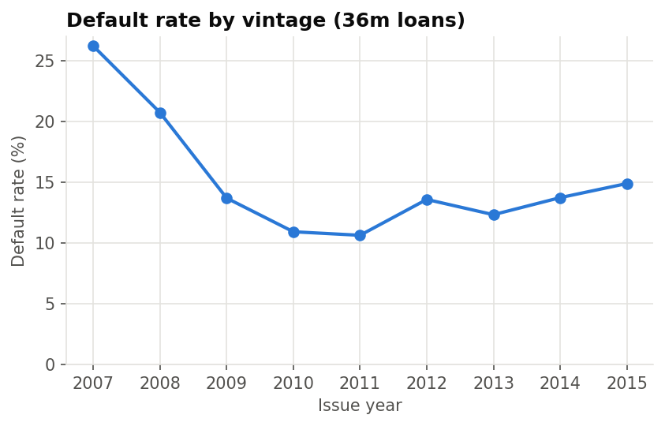
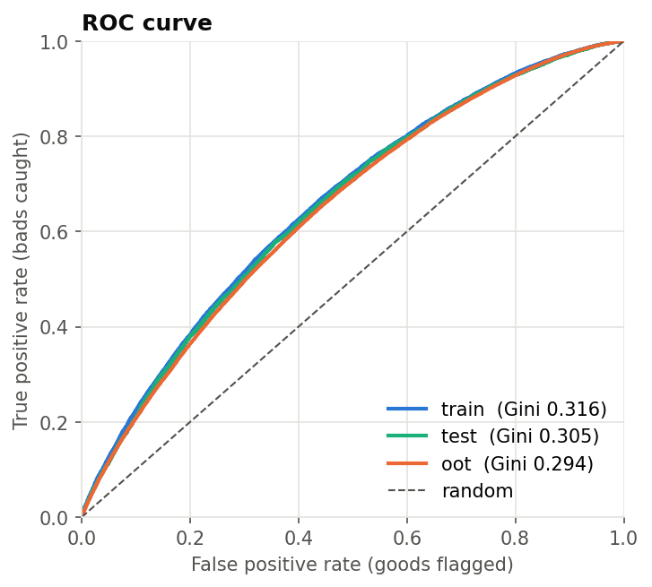
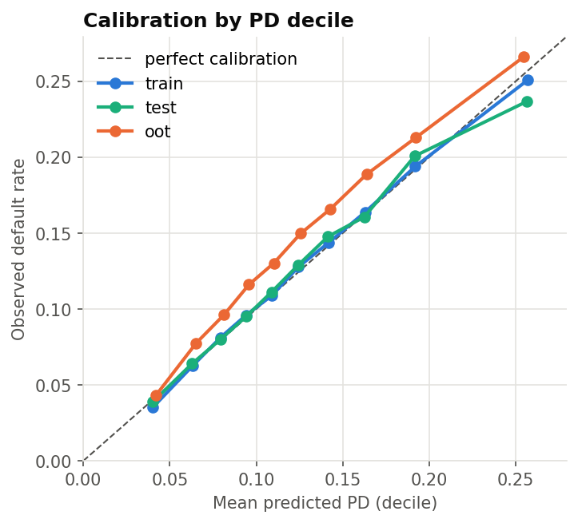
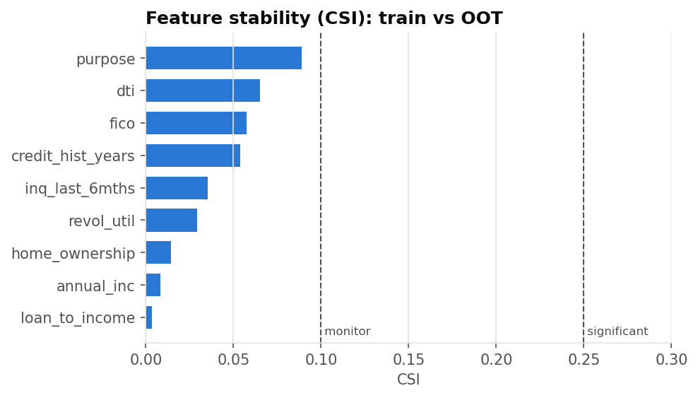

# PD Scorecard — Model Validation Report

*Auto-generated by `scripts/run_pipeline.py`. Numbers below come from the latest run;
commentary comes from `reports/commentary.md`; sections still marked ✍️ have not been written yet.*

## 1. Executive summary

| Item | Value |
|---|---|
| Model | Logistic regression on WoE-binned application features (scorecard) |
| Portfolio | LendingClub 36-month unsecured consumer loans |
| Target | Default = charged off over the loan's life (36m horizon) |
| Final features | 9: `fico`, `annual_inc`, `loan_to_income`, `inq_last_6mths`, `purpose`, `dti`, `revol_util`, `home_ownership`, `credit_hist_years` |
| Scaling | 600 points at 30:1 good:bad odds, PDO = 20 |

**Validation outcome**

| Test | Result | Status |
|---|---|---|
| Discrimination (OOT Gini) | 0.294 | RED |
| Gini deterioration train → OOT | 7.0% | GREEN |
| Score PSI train → OOT | 0.001 | GREEN |
| Rank ordering monotonic (OOT deciles) | Yes | GREEN |
| Calibration-in-the-large (OOT mean PD − observed DR) | -1.73% | AMBER |
| Grades failing binomial test (OOT, PD too low) | 7 of 7 | RED |

**Fit with conditions: usable for ranking applicants; not usable for absolute PDs until recalibrated.**

- *Ranking holds up out of time.* Gini falls only 7% from train (0.316) to OOT (0.294), the score
  distribution is stable (PSI 0.002) and default rates fall monotonically across all ten OOT score
  deciles, from 26.6% in the worst to 4.3% in the best.
- *Discrimination is modest.* OOT Gini of 0.294 sits just below this project's 0.30 amber threshold,
  which is expected for a model limited to application data with no detailed bureau history.
- *PDs are too low on recent loans.* Mean predicted PD on 2014–15 loans is 12.7% against an observed
  14.5%, and all seven rating grades fail the binomial test.

Conditions: (1) re-fit the intercept on recent vintages before the PDs are used for pricing,
provisioning or capital; (2) monitor Gini and PSI quarterly against the thresholds in `config.py`.

## 2. Data and sample definition

| sample | n_loans | n_defaults | default_rate | first_issue | last_issue |
|---|---|---|---|---|---|
| train | 122798 | 15510 | 0.1263 | 2007-06 | 2013-12 |
| test | 52628 | 6647 | 0.1263 | 2007-06 | 2013-12 |
| oot | 445596 | 64447 | 0.1446 | 2014-01 | 2015-12 |

- Only 36-month loans issued 2007–2015, so every loan has had the
  chance to reach maturity in the data snapshot (avoids resolution bias).
- Loans still Current / Late / In Grace Period are excluded (outcome unknown).
- Development sample = vintages ≤ 2013 (70/30 train/test split, stratified).
  Out-of-time (OOT) sample = later vintages.
- Excluded on purpose: any post-origination field (leakage) and LendingClub's own
  `grade` / `sub_grade` / `int_rate` (kept only as a benchmark).

## 3. Feature engineering and selection

Information Value (train):

| index | iv | strength | n_bins |
|---|---|---|---|
| fico | 0.1417 | medium | 10 |
| annual_inc | 0.0934 | weak | 11 |
| loan_to_income | 0.0414 | weak | 9 |
| inq_last_6mths | 0.0400 | weak | 5 |
| mort_acc | 0.0380 | weak | 7 |
| purpose | 0.0352 | weak | 10 |
| dti | 0.0351 | weak | 9 |
| revol_util | 0.0341 | weak | 11 |
| home_ownership | 0.0311 | weak | 4 |
| credit_hist_years | 0.0206 | weak | 8 |
| emp_length_yrs | 0.0139 | useless | 5 |
| total_acc | 0.0134 | useless | 10 |
| revol_bal | 0.0109 | useless | 7 |
| loan_amnt | 0.0054 | useless | 6 |
| pub_rec | 0.0013 | useless | 3 |
| open_acc | 0.0007 | useless | 4 |
| verification_status | 0.0006 | useless | 3 |
| delinq_2yrs | 0.0000 | useless | 3 |

Selection by missing rate, IV and correlation:

| feature | iv | decision | reason |
|---|---|---|---|
| fico | 0.1417 | kept |  |
| annual_inc | 0.0934 | kept |  |
| loan_to_income | 0.0414 | kept |  |
| inq_last_6mths | 0.0400 | kept |  |
| mort_acc | 0.0380 | dropped | 21% missing > 10% |
| purpose | 0.0352 | kept |  |
| dti | 0.0351 | kept |  |
| revol_util | 0.0341 | kept |  |
| home_ownership | 0.0311 | kept |  |
| credit_hist_years | 0.0206 | kept |  |
| emp_length_yrs | 0.0139 | dropped | IV 0.014 < 0.02 |
| total_acc | 0.0134 | dropped | IV 0.013 < 0.02 |
| revol_bal | 0.0109 | dropped | IV 0.011 < 0.02 |
| loan_amnt | 0.0054 | dropped | IV 0.005 < 0.02 |
| pub_rec | 0.0013 | dropped | IV 0.001 < 0.02 |
| open_acc | 0.0007 | dropped | IV 0.001 < 0.02 |
| verification_status | 0.0006 | dropped | IV 0.001 < 0.02 |
| delinq_2yrs | 0.0000 | dropped | IV 0.000 < 0.02 |

Backward elimination (significance and sign checks):

_No features removed._

## 4. Final model

| index | coef | std_err | p_value | vif |
|---|---|---|---|---|
| const | -1.9379 | 0.0090 | 0.0000 |  |
| fico | -0.8145 | 0.0289 | 0.0000 | 1.4896 |
| annual_inc | -0.6599 | 0.0340 | 0.0000 | 1.3934 |
| loan_to_income | -0.7103 | 0.0459 | 0.0000 | 1.1881 |
| inq_last_6mths | -1.1055 | 0.0439 | 0.0000 | 1.0448 |
| purpose | -1.0631 | 0.0469 | 0.0000 | 1.0090 |
| dti | -0.4821 | 0.0492 | 0.0000 | 1.1398 |
| revol_util | -0.3178 | 0.0579 | 0.0000 | 1.5126 |
| home_ownership | -0.4285 | 0.0536 | 0.0000 | 1.1571 |
| credit_hist_years | -0.1853 | 0.0651 | 0.0044 | 1.1705 |

All WoE coefficients are negative (higher WoE = safer = lower PD), as required. VIF > 5 would flag collinearity.

Full points table: `reports/tables/scorecard_points.csv`.

## 5. Performance by sample

| index | n | auc | gini | ks | mean_pd | observed_dr | brier | hl_pvalue | challenger_gini | lc_subgrade_gini | score_psi_vs_train |
|---|---|---|---|---|---|---|---|---|---|---|---|
| train | 122798 | 0.6579 | 0.3157 | 0.2274 | 0.1263 | 0.1263 | 0.1065 | 0.1011 | 0.4409 | 0.2838 |  |
| test | 52628 | 0.6524 | 0.3047 | 0.2215 | 0.1261 | 0.1263 | 0.1069 | 0.0284 | 0.3249 | 0.2743 | 0.0001 |
| oot | 445596 | 0.6468 | 0.2936 | 0.2109 | 0.1273 | 0.1446 | 0.1200 | 0.0000 | 0.3164 | 0.3425 | 0.0015 |

- `challenger_gini`: gradient-boosting model on the raw features — the price of interpretability.
- `lc_subgrade_gini`: LendingClub's own sub-grade used as a ranking — an external benchmark.

- *Train vs test:* Gini 0.316 vs 0.305 and KS 0.227 vs 0.221. The gap is small, so the scorecard is
  not overfitting, as expected for a 9-feature logistic regression on monotonic bins.
- *Test vs OOT:* Gini 0.305 vs 0.294. The small drop reflects the shift in the borrower mix across
  vintages (see section 6), not a breakdown of the risk drivers: every feature's CSI is below 0.10.
- *Scorecard vs challenger:* gradient boosting reaches 0.441 on train but only 0.325 on test and
  0.316 OOT, so most of its in-sample edge is overfitting. Out of time it beats the scorecard by just
  0.02 Gini. That is the price of interpretability here, and it is small.
- *Scorecard vs LendingClub sub-grade:* the scorecard ranks better than LendingClub's sub-grade on
  2007–13 loans (0.305 vs 0.274 on test) but worse on 2014–15 loans (0.294 vs 0.343). LendingClub's
  grading uses more data than these 24 columns and was itself refined over time, so it is a
  demanding benchmark on the later vintages.

## 6. Calibration — binomial test by rating grade (OOT)

| grade | n | defaults | mean_pd | observed_dr | p_value | result |
|---|---|---|---|---|---|---|
| 1 | 58224 | 2871 | 0.0461 | 0.0493 | 0.0001 | RED: PD too low |
| 2 | 63123 | 5554 | 0.0738 | 0.0880 | 0.0000 | RED: PD too low |
| 3 | 65223 | 7448 | 0.0951 | 0.1142 | 0.0000 | RED: PD too low |
| 4 | 64561 | 8917 | 0.1164 | 0.1381 | 0.0000 | RED: PD too low |
| 5 | 65382 | 10708 | 0.1405 | 0.1638 | 0.0000 | RED: PD too low |
| 6 | 64868 | 12756 | 0.1724 | 0.1966 | 0.0000 | RED: PD too low |
| 7 | 64215 | 16193 | 0.2386 | 0.2522 | 0.0000 | RED: PD too low |

The OOT default rate (14.5%) is above the development rate (12.6%), and the model, calibrated on
development loans, under-predicts in every grade by 0.3 to 2.4 percentage points.

The drift comes from changes in who was lending and borrowing, not from the model breaking down.
Default rates bottomed at 10.6% for 2011 loans, when post-crisis underwriting was tight, then rose
every year to 14.9% for 2015 loans. Over the same period LendingClub grew quickly (from 14k loans in
this sample in 2011 to 283k in 2015) and accepted more indebted borrowers: average debt-to-income
rose from 13.5% to 18.5%, while average FICO fell from 718 to 696. Because the scorecard's binned
features capture most of that shift, the ranking survives, but the base default rate moved.

**Recommendation:** keep the WoE bins and coefficients and re-fit only the intercept on the most
recent mature vintages, so the mean PD matches the recent default rate. Then repeat the binomial
test by grade on a later hold-out. A full re-development is not justified, because rank ordering
and stability are both satisfactory.

## 7. Stability

Score PSI train → test: **0.000**; train → OOT: **0.001**.

| index | csi |
|---|---|
| purpose | 0.0889 |
| dti | 0.0651 |
| fico | 0.0577 |
| credit_hist_years | 0.0539 |
| inq_last_6mths | 0.0354 |
| revol_util | 0.0291 |
| home_ownership | 0.0145 |
| annual_inc | 0.0085 |
| loan_to_income | 0.0033 |

## 8. Limitations and recommendations

- **Reject inference:** only approved loans are observed, so the model learns from a population
  LendingClub had already filtered. Its PDs would be too low if applied to all applicants.
- **Lifetime, not 12-month, PD:** the target is default at any point over a 36-month life. Basel IRB
  and IFRS 9 stage 1 need a 12-month PD, which would require payment-level data to build.
- **Through-the-cycle:** there are no macroeconomic variables, so PDs do not move with the economy,
  and the development window (2007–13) is dominated by the post-crisis recovery.
- **Feature availability:** `mort_acc` was excluded because LendingClub only recorded it from 2012.
  The gradient-boosting challenger still sees it, with missing values for older loans, so its
  train and test Gini are slightly flattered.
- **Monitoring plan:** track score PSI and per-feature CSI quarterly (amber 0.10, red 0.25), Gini
  on each new mature vintage (amber below 0.30), and calibration-in-the-large each year, with
  intercept recalibration whenever the gap exceeds 1 percentage point.
